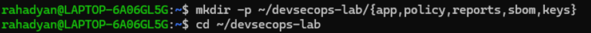

# LAPORAN PRAKTIKUM BAB 1

## **Fondasi Teoretis dan Kerangka Kerja DevSecOps**

---

#### **Nama : Rahadyan Danang Susetyo Pranawa**

#### **NIM : 3126640054**

#### **Kelas : 1 STrLJ IT Kelas B**

#### **Tanggal pelaksanaan : 15 September 2026**

---

### 1. Tujuan Praktikum

- **Menyusun *Baseline* Laboratorium:** Menyiapkan dan memverifikasi dasar lingkungan kerja (struktur direktori, versi *software*, akses Docker Engine & Compose v2, serta fitur keamanan *host*) sebelum lanjut ke tahap berikutnya.
- **Analisis Kritis Hasil Verifikasi:** Melatih kemampuan mengevaluasi *output* perintah secara obyektif—tidak sekadar menganggapnya sebagai bukti aman, tetapi juga mempertimbangkan konteks, keterbatasan lingkungan, versi perangkat, dan risiko yang berpotensi timbul.

### 2. Dasar Teori

---

Perkembangan digital menuntut organisasi bertransformasi menuju **kelincahan bisnis** (*business agility*) dengan menjadikan perangkat lunak sebagai inti layanan, di mana pendekatan tradisional seperti *Waterfall* telah bergeser ke **DevOps** guna menyatukan *development* dan *operations* melalui otomatisasi integrasi serta pengiriman secara berkelanjutan (CI/CD) dalam rilis-rilis kecil yang lebih aman. Kendati demikian, DevOps bukan sekadar *pipeline* melainkan sistem sosio-teknis dan budaya yang didukung oleh arsitektur modern seperti *microservices* serta *container*, yang bermuara pada penyediaan platform terintegrasi (*golden path*). Guna mengimbangi kecepatan rilis tersebut tanpa mengorbankan aspek keselamatan, konsep ini berkembang menjadi **DevSecOps**—suatu pendekatan yang mengintegrasikan keamanan di seluruh siklus pengembangan melalui pengujian seawal mungkin (*shift-left*) dan pemantauan real-time (*shift-right*), penerapan *security gate*, manajemen risiko berbasis konteks, pengamanan rantai pasok perangkat lunak (*software supply chain*), serta pendokumentasian bukti audit (*evidence as product*) yang transparan dan dapat diverifikasi.

---

### 3. Alat dan Lingkungan Pengembangan

---

| Komponen | Hasil Identifikasi |
| --- | --- |
| **Operating system** | **Ubuntu 26.04.1 LTS** |
| **Kernel** | **Linux 6.18.33.2-microsoft-standard-WSL2, x86_64** |
| **Pengguna eksekusi** | `rahadyan` |
| **Direktori kerja** | `/home/rahadyan/devsecops-lab` |
| **Git** | **2.53.0** |
| **OpenSSL** | **3.5.5, 27 Januari 2026** |
| **cURL** | **8.18.0** |
| **Docker Engine** | **29.8.0** (Build 88096ef) |
| **Docker Compose** | **v5.5.1** |

---

### Ringkasan Lingkungan Kerja:

- **Akses Pengguna**: Berjalan menggunakan akun non-root (`rahadyan`).
- **Ketersediaan Docker**: Docker Engine (v29.8.0) & Docker Compose (v5.5.1) telah terpasang dan aktif di lingkungan sistem ini.
- **Workspace Root**: Berada pada direktori `/home/rahadyan/devsecops-lab`.

### 4. Praktikum Mandiri

---

1. Membuat direktori devseclab dan menerapkan brace expansion untuk membuat sub direktori.
    
    
    
    
    
2. Cek versi docker dan compose docker
    
    
    
    
    
3. Menampilkan versi git, openssl dan curl
    
    
    
4. Memeriksa fitur keamanan dan mekanisme keamanan pada kernel.
    
    
    

### 5. Evaluasi dan Verifikasi

---

1. **Mengapa DevSecOps tidak dapat direduksi menjadi penambahan scanner pada pipeline?**
    
    Karena DevSecOps adalah sistem sosio teknis, sistem ini melibatkan interaksi antara manusia (developer, security engineer, operator, product owner), proses (kebijakan, alur kerja), dan teknologi (pipeline, platform). Scanner disini adalah tools yang menghasilkan temuan, bukan pengambil keputusan. Tanpa kejelasan siapa yang menindaklanjuti temuan, hasil scan akan cenderung diabaikan. Selain itu keterbatasan scanner pada pipeline adalah tidak bisa mengatasi berbagai ancaman yang datang saat aplikasi dalam tahap produksi sehingga diperlukan pengawasan oleh manusia dan deteksi runtime yang berkelanjutan. Mengandalkan scanner semata tanpa budaya dan kebijakan yang mendukung justru berisiko. Apabila gate terlalu ketat tanpa proses triase yang jelas, tim cenderung akan mencari cara untuk melewati atau mematikan scanner tersebut, sehingga tujuan keamanannya gagal sama sekali.
    
2. **Evidence apa yang membedakan klaim kontrol dari kontrol yang benar-benar terverifikasi?**
    
    **Evidence as product** adalah keamanan tidak bisa hanya diklaim secara lisan atau dengan laporan yang sulit ditelusuri dan harus dibuktikan dengan artefak yang konkret dan dapat diproses ulang. Contoh evidence yang dimaksud:
    
    - **Laporan SARIF** : hasil pemeriksaan keamanan kode dalam format standar yang bisa dibaca mesin.
    - **JUnit XML** : hasil pengujian otomatis yang terstruktur.
    - **SBOM (Software Bill of Materials)** dalam format CycloneDX atau SPDX — daftar lengkap komponen/dependensi yang digunakan dalam software.
    - **Attestations** : pernyataan terverifikasi tentang bagaimana sebuah artefak dibuat (provenance).
    - **Hasil policy evaluation** : bukti bahwa suatu artefak sudah dicek terhadap kebijakan tertentu sebelum di-deploy.
    - **Log deployment dan event runtime** : jejak nyata tentang kapan dan bagaimana perubahan diterapkan ke sistem produksi.
3. **Bagaimana shared responsibility memengaruhi ownership risiko dan tindak lanjut temuan?**
    
    Prinsip tanggung jawab bersama (shared responsibility) dalam DevSecOps tidak berarti semua orang mengerjakan semua hal. Justru sebaliknya — pembagian peran tetap jelas dan spesifik, tapi akuntabilitas terhadap hasil akhir dibagi, bukan didelegasikan sepenuhnya ke satu pihak (misalnya, tim security saja).
    
    **Pembagian peran:**
    
    - **Product owner** → menetapkan toleransi risiko dan kebutuhan bisnis (menentukan seberapa besar risiko yang bisa diterima).
    - **Developer** → menerapkan secure coding dan bertanggung jawab memperbaiki temuan pada kode yang mereka tulis.
    - **Platform engineer** → menyediakan jalur build (pipeline) yang aman sebagai fondasi bersama.
    - **Security engineer** → mengembangkan threat model, rule, dan kebijakan keamanan.
    - **Operator** → mengelola hardening sistem dan deteksi ancaman saat runtime.
    - **Auditor** → menilai apakah evidence yang dihasilkan sudah cukup memadai sebagai bukti kepatuhan.
    
    **Dampaknya terhadap ownership risiko:**
    
    - Risiko tidak lagi menjadi masalah tim security semata, setiap peran memiliki bagian tanggung jawabnya sendiri sesuai konteks kerjanya. Developer tidak bisa lagi berkata "*itu bukan urusan saya, itu urusan security*", karena mereka juga punya kewajiban memperbaiki kerentanan pada kode yang mereka buat.
    - Ini mencegah area abu-abu dimana situasi ketika sebuah temuan keamanan menghambat rilis, tapi tidak jelas siapa yang berwenang mengambil keputusan (apakah harus diperbaiki dulu, atau bisa diberi waiver).
    
    **Dampaknya terhadap tindak lanjut temuan:**
    
    - Karena setiap peran punya area tanggung jawab yang jelas, temuan keamanan bisa langsung diarahkan ke pemilik yang tepat, bukan menumpuk di satu tim yang kewalahan.
    - Mekanisme seperti RACI (Responsible, Accountable, Consulted, Informed), security champion (developer yang jadi "perwakilan" isu keamanan di timnya), review dua orang, dan escalation path (jalur eskalasi ketika ada perbedaan pendapat) menjadi alat bantu penting untuk memastikan temuan benar-benar ditindaklanjuti, bukan sekadar tercatat dan diabaikan.
    - Pendekatan ini juga mendukung budaya belajar: temuan disajikan dengan konteks dan saran perbaikan (bukan untuk menyalahkan), sehingga insiden atau kerentanan yang ditemukan menghasilkan perbaikan sistemik (rule baru, unit test regresi, rotasi secret, dsb.), bukan sekadar tambal sulam sesaat.

---

### 6. Kesimpulan

Berdasarkan praktikum yang telah dilakukan, dapat disimpulkan bahwa DevSecOps merupakan pendekatan yang mengintegrasikan aspek pengembangan, operasional, dan keamanan dalam seluruh siklus hidup perangkat lunak. Penerapan DevSecOps tidak cukup hanya dengan menambahkan scanner pada pipeline, tetapi juga membutuhkan budaya kolaborasi, pembagian tanggung jawab yang jelas, manajemen risiko, serta tindak lanjut terhadap setiap temuan keamanan.

Verifikasi lingkungan laboratorium menunjukkan bahwa komponen dasar, seperti sistem operasi, Git, OpenSSL, cURL, Docker Engine, dan Docker Compose, telah tersedia dan dapat digunakan. Pemeriksaan tersebut menjadi baseline penting sebelum menjalankan proses pengembangan dan deployment. Namun, hasil verifikasi harus dianalisis secara kritis karena keberadaan atau keberhasilan suatu perintah belum otomatis membuktikan bahwa seluruh sistem telah aman.

Selain itu, konsep *evidence as product* menegaskan pentingnya bukti yang konkret, terstruktur, dan dapat diverifikasi, seperti laporan SARIF, JUnit XML, SBOM, attestations, hasil evaluasi kebijakan, log deployment, dan event runtime. Dengan menerapkan prinsip *shift-left*, *shift-right*, *security gate*, serta *shared responsibility*, organisasi dapat mendeteksi dan menangani risiko lebih awal sekaligus menjaga keamanan aplikasi secara berkelanjutan. Oleh karena itu, DevSecOps harus dipahami sebagai proses sosio-teknis yang menyatukan manusia, proses, dan teknologi untuk menghasilkan perangkat lunak yang cepat, andal, dan aman.
