# LAPORAN PRAKTIKUM BAB 3

## Docker Network, Volume, Bind Mount, tmpfs, dan Compose

**Nama**: **Rahadyan Danang Susetyo Pranawa**

**NIM**: **3126640054**

**Kelas**: **1 STrLJ IT Kelas B**

**Tanggal pelaksanaan**: 16 september 2026

---

## 1. Tujuan Praktikum

Praktikum Bab 3 bertujuan memahami pengelolaan komunikasi antar-container, penyimpanan data container, serta penyusunan aplikasi multi-container menggunakan Docker Compose.

Setelah menyelesaikan praktikum ini, mahasiswa diharapkan mampu:

1. Membuat user-defined bridge network dan membuktikan name resolution antar-container.
2. Membedakan volume, bind mount, dan tmpfs dari sisi persistensi, portabilitas, dan keamanan.
3. Menulis file Compose untuk aplikasi multi-container yang memiliki service, network, volume, dan healthcheck.
4. Mengelola lifecycle aplikasi dengan `docker compose up`, `ps`, `logs`, `stop`, `start`, `down`, dan `down -v`.

---

## 2. Dasar Teori Singkat

Docker network mengatur keterjangkauan antar-container. Pada aplikasi multi-container, penggunaan user-defined bridge lebih disarankan daripada default bridge karena menyediakan isolasi yang lebih jelas dan DNS internal berbasis nama container atau nama service. Dengan mekanisme ini, container tidak perlu menggunakan alamat IP statis yang dapat berubah ketika container dibuat ulang.

Docker menyediakan beberapa mekanisme penyimpanan data. Writable layer mengikuti lifecycle container sehingga tidak cocok untuk data penting. Named volume dikelola oleh Docker dan cocok untuk data persisten seperti database. Bind mount memetakan path host langsung ke container sehingga berguna untuk development, tetapi memiliki risiko karena container dapat membaca atau mengubah file host. tmpfs menyimpan data di memori dan akan hilang ketika container berhenti, sehingga sesuai untuk cache atau data sementara yang tidak perlu persist.

Docker Compose digunakan untuk mendeskripsikan aplikasi multi-container secara deklaratif dalam file YAML. Service, network, volume, environment, port mapping, dependency, dan healthcheck dapat ditulis dalam satu konfigurasi sehingga aplikasi lebih mudah dijalankan ulang dan didokumentasikan.

| Mekanisme | Persistensi | Ketergantungan Host | Contoh Penggunaan | Risiko Utama |
| --- | --- | --- | --- | --- |
| Writable layer | Hilang saat container dihapus | Rendah | File sementara kecil | Sulit di-backup |
| Named volume | Tetap ada setelah container dihapus | Rendah-sedang | Database, data aplikasi | Salah hapus dengan `down -v` atau prune |
| Bind mount | Mengikuti file host | Tinggi | Source code dan konfigurasi lokal | Container dapat mengubah file host |
| tmpfs | Hilang saat stop/restart | Bergantung RAM host | Cache dan data sementara sensitif | Mengonsumsi memori host |

---

## 3. Alat dan Lingkungan

| Komponen | Hasil Identifikasi |
| --- | --- |
| Operating System | Ubuntu 26.04.1 LTS |
| Kernel | Linux 6.18.33.2-microsoft-standard-WSL2, x86_64 |
| Pengguna eksekusi | rahadyan |
| Direktori kerja | `/home/rahadyan/docker-lab/bab-3` |
| Docker Engine | 29.8.0 (Build 88096ef) |
| Docker CLI | docker-ce-cli |
| Docker Compose | docker compose plugin v2 |
| Image utama | `nginx:alpine`, `alpine:3.20`, `postgres:16-alpine`, aplikasi Flask |

---

## 4. Langkah Praktikum

### 4.1 Persiapan Direktori Kerja

Direktori kerja dibuat khusus untuk Bab 3 agar file Compose, konfigurasi Nginx, source aplikasi, dan artefak backup tidak bercampur dengan bab lain.

```bash
mkdir -p ~/docker-lab/bab-3
cd ~/docker-lab/bab-3
```

### 4.2 User-defined Bridge Network

Pada tahap ini dibuat network `lab-net` dengan driver bridge. Dua container Nginx dijalankan pada network yang sama, kemudian container `server-a` melakukan ping ke `server-b` menggunakan nama container.

```bash
docker network create --driver bridge --subnet 172.20.0.0/16 lab-net
docker run -d --name server-a --network lab-net nginx:alpine
docker run -d --name server-b --network lab-net nginx:alpine
docker exec server-a ping -c 3 server-b
docker rm -f server-a server-b
```

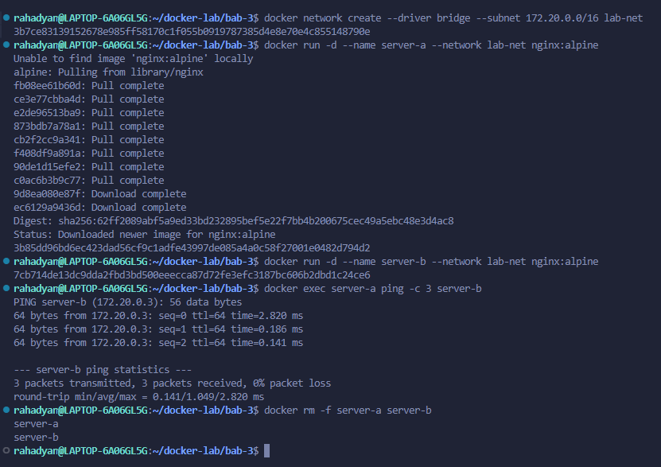
*Gambar 1. Container `server-a` berhasil melakukan resolve nama dan ping ke `server-b` melalui user-defined bridge network.*

### 4.3 Volume Backup dan Restore

Named volume `data-vol` dibuat untuk menyimpan file log. Container `writer` menulis timestamp ke `/app/data/log.txt`, kemudian container dihapus. Data tetap dapat dibaca melalui container lain karena berada di volume, bukan writable layer container.

```bash
docker volume create data-vol
docker run -d --name writer -v data-vol:/app/data alpine:3.20 \
  sh -c "while true; do date >> /app/data/log.txt; sleep 5; done"
sleep 15
docker rm -f writer
docker run --rm -v data-vol:/data alpine:3.20 cat /data/log.txt
docker run --rm -v data-vol:/source:ro -v $(pwd):/backup alpine:3.20 \
  tar czf /backup/data-vol-backup.tar.gz -C /source .
```
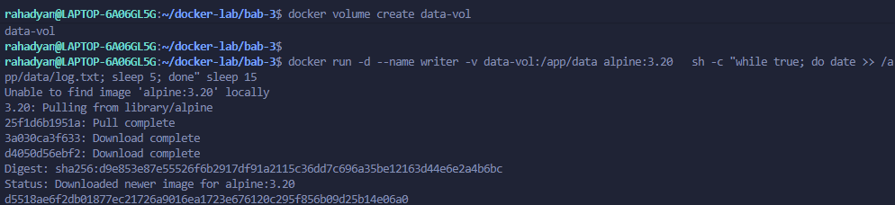
*Gambar 2. Pembuatan Volume.*
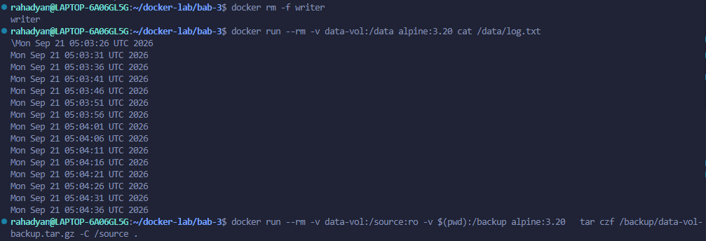
*Gambar 3. Proses Backup Volume.*
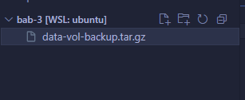
*Gambar 4. Data pada named volume tetap tersedia setelah container `writer` dihapus dan berhasil dibuat backup `data-vol-backup.tar.gz`.*

### 4.4 Compose Multi-container Nginx, Flask, dan PostgreSQL

Aplikasi multi-container disusun menggunakan Docker Compose. Service `web` berfungsi sebagai reverse proxy Nginx, service `app` menjalankan aplikasi Flask, dan service `db` menjalankan PostgreSQL. Network dipisahkan menjadi `frontend` dan `backend` agar database hanya dapat dijangkau oleh aplikasi.

```yaml
services:
  web:
    image: nginx:alpine
    ports:
      - "8080:80"
    volumes:
      - ./html:/usr/share/nginx/html:ro
      - ./nginx.conf:/etc/nginx/conf.d/default.conf:ro
    networks: [frontend]
    depends_on: [app]

  app:
    build: ./app
    environment:
      DB_HOST: db
      DB_NAME: labdb
      DB_USER: labuser
      DB_PASS: labpass123
    networks: [frontend, backend]
    depends_on:
      db:
        condition: service_healthy

  db:
    image: postgres:16-alpine
    environment:
      POSTGRES_DB: labdb
      POSTGRES_USER: labuser
      POSTGRES_PASSWORD: labpass123
    volumes:
      - pg-data:/var/lib/postgresql/data
    networks: [backend]
    healthcheck:
      test: ["CMD-SHELL", "pg_isready -U labuser -d labdb"]
      interval: 5s
      timeout: 5s
      retries: 5

volumes:
  pg-data:

networks:
  frontend:
  backend:
```

Stack dijalankan dengan perintah berikut:

```bash
docker compose up -d
docker compose ps
docker compose logs --tail 100
curl -v http://localhost:8080
```
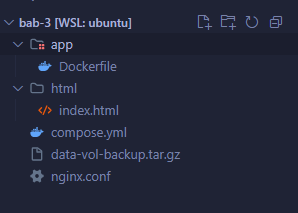
*Gambar 5. Struktur Folder.*
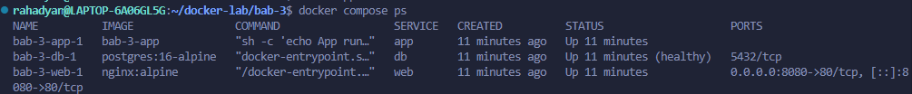
*Gambar 6. Output `docker compose ps` menunjukkan service `web`, `app`, dan `db` berjalan.*

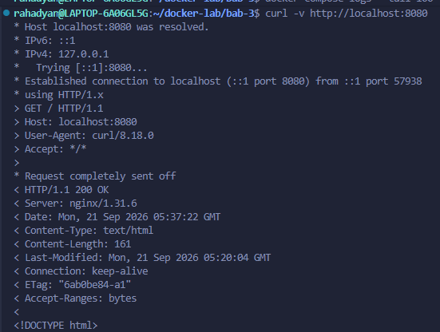
*Gambar 7. Hasil `curl http://localhost:8080` membuktikan service web dapat diakses dari host melalui port yang dipublikasikan.*
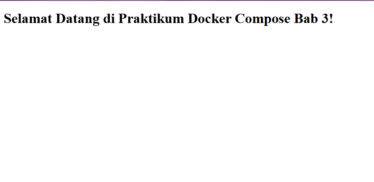
*Gambar 8. Check di browser untuk localhost:8080.*

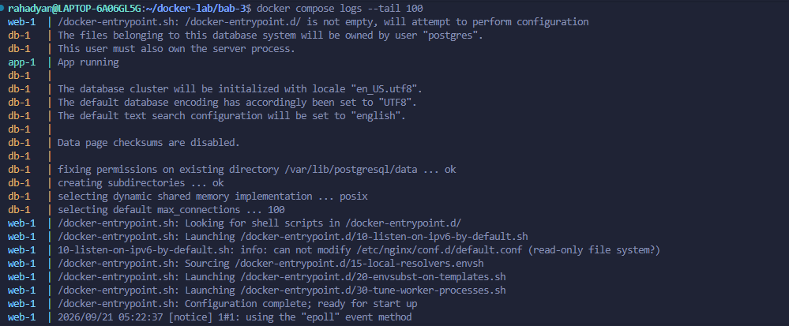
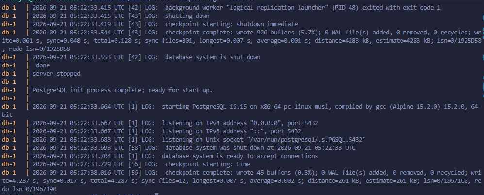
*Gambar 9. Cuplikan log menunjukkan service aplikasi dan database berjalan serta healthcheck PostgreSQL berhasil.*

---

## 5. Hasil Pengujian

### 5.1 Pengujian Network

Pengujian user-defined bridge berhasil ketika `server-a` dapat mengakses `server-b` menggunakan nama container. Hal ini membuktikan bahwa Docker DNS internal pada user-defined bridge bekerja dengan baik. Penggunaan nama container atau nama service lebih stabil daripada alamat IP karena IP container dapat berubah ketika container dibuat ulang.

### 5.2 Pengujian Volume

Data yang ditulis oleh container `writer` tetap tersedia setelah container tersebut dihapus. Ini menunjukkan bahwa named volume memiliki lifecycle terpisah dari container. Backup volume juga berhasil dibuat menggunakan container sementara dengan mount read-only pada sumber data.

### 5.3 Pengujian Compose

Compose stack berhasil dijalankan dengan tiga service utama. Service `web` dipublikasikan ke host melalui port `8080`, sedangkan service `app` berada pada network `frontend` dan `backend`. Service `db` hanya berada pada network `backend`, sehingga database tidak langsung terekspos ke host maupun frontend publik.

| Pengujian | Hasil |
| --- | --- |
| Resolve nama container pada `lab-net` | Berhasil |
| Data named volume tetap ada setelah container dihapus | Berhasil |
| Backup volume ke file `.tar.gz` | Berhasil |
| Compose stack berjalan | Berhasil |
| Akses aplikasi melalui `localhost:8080` | Berhasil |
| Database hanya berada pada network backend | Berhasil |

---

## 6. Threat Statement

**Aset yang dilindungi** mencakup data pada named volume, konfigurasi Compose, kredensial database, service aplikasi, network backend, dan port yang dipublikasikan ke host.

**Aktor ancaman** yang relevan meliputi pengguna lokal yang memiliki akses Docker, proses aplikasi yang terkompromi, container yang diberi mount terlalu luas, serta pihak eksternal yang dapat mengakses port host yang terbuka.

**Jalur serangan** yang perlu diperhatikan:

- **Port publishing berlebihan**: Service internal seperti database tidak boleh dipublikasikan ke host tanpa kebutuhan yang jelas.
- **Bind mount writable**: Container yang diberi bind mount dengan akses tulis dapat mengubah atau menghapus file host.
- **Kredensial pada Compose**: Password database yang ditulis langsung pada `compose.yaml` berisiko ikut ter-commit ke repository.
- **Volume tanpa backup**: Named volume persisten, tetapi tidak otomatis aman dari penghapusan, korupsi, atau kesalahan operator.
- **Network segmentation lemah**: Service yang tidak perlu saling berkomunikasi sebaiknya tidak ditempatkan pada network yang sama.

**Dampak** yang mungkin terjadi meliputi kebocoran data database, perubahan file host, downtime aplikasi, kehilangan data volume, dan perluasan attack surface akibat port yang tidak perlu terbuka.

---

## 7. Analisis

### 7.1 User-defined Bridge dan DNS Internal

User-defined bridge lebih sesuai untuk aplikasi multi-container karena menyediakan DNS internal otomatis. Pada praktikum ini, `server-a` dapat mengakses `server-b` tanpa mengetahui alamat IP-nya. Pola yang sama digunakan oleh Compose ketika service `app` mengakses database melalui hostname `db`.

### 7.2 Persistensi Data pada Volume

Named volume memisahkan data dari lifecycle container. Ketika container `writer` dihapus, file `log.txt` tetap tersedia karena disimpan pada `data-vol`. Namun, persistensi tidak sama dengan backup. Volume tetap dapat hilang jika menjalankan `docker compose down -v`, `docker volume rm`, atau `docker volume prune`.

### 7.3 Risiko Bind Mount dan tmpfs

Bind mount sangat membantu saat development karena perubahan file host dapat langsung terlihat di container. Namun, akses tulis pada bind mount meningkatkan risiko terhadap host. Untuk konfigurasi Nginx dan file statis, penggunaan `:ro` sudah tepat karena container tidak perlu mengubah file tersebut. tmpfs berguna untuk data sementara, tetapi tidak boleh digunakan untuk data yang harus bertahan setelah restart.

### 7.4 Compose, Healthcheck, dan Dependency

`depends_on` biasa hanya mengatur urutan startup, bukan kesiapan service. Pada service `app`, dependency ke `db` menggunakan `condition: service_healthy`, sehingga aplikasi menunggu PostgreSQL siap berdasarkan healthcheck `pg_isready`. Ini lebih aman dibanding mengandalkan urutan start saja.

### 7.5 Masalah dan Diagnosis

Masalah yang berpotensi muncul adalah service aplikasi gagal terhubung ke database walaupun container `db` sudah berjalan. Diagnosis dilakukan secara bertahap dengan memeriksa `docker compose ps`, membaca `docker compose logs --tail 100`, memastikan healthcheck database sehat, lalu memastikan hostname `db`, nama database, username, dan password pada environment sudah sesuai.

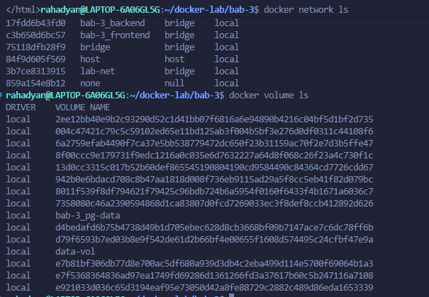
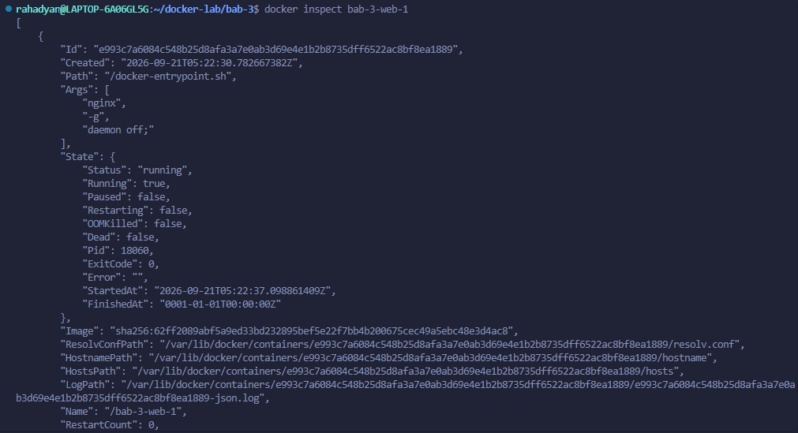

---

## 8. Rekomendasi Production-like Environment

1. Batasi port yang dipublikasikan hanya pada service yang benar-benar menjadi ingress, misalnya `web`.
2. Gunakan network terpisah untuk frontend dan backend agar database tidak terekspos ke zona publik.
3. Hindari menyimpan password langsung di `compose.yaml`; gunakan Compose secrets atau secret manager.
4. Terapkan bind mount read-only untuk file konfigurasi dan file statis.
5. Gunakan user non-root, capability minimum, dan filesystem read-only bila aplikasi mendukung.
6. Buat prosedur backup dan restore volume database secara berkala.
7. Pin versi image atau gunakan digest agar deployment lebih reproducible.
8. Jalankan `docker compose config` untuk memvalidasi konfigurasi efektif sebelum deployment.

---

## 9. Kesimpulan

Praktikum Bab 3 menunjukkan bahwa Docker network, mount, dan Compose merupakan komponen penting dalam menjalankan aplikasi container yang lebih realistis. User-defined bridge memudahkan komunikasi antar-container menggunakan nama service. Named volume menjaga data tetap tersedia setelah container dihapus, sedangkan bind mount dan tmpfs memiliki kegunaan berbeda sesuai kebutuhan development, konfigurasi, atau data sementara.

Docker Compose menyederhanakan pengelolaan aplikasi multi-container karena seluruh service, network, volume, port, dan healthcheck dapat ditulis dalam satu file deklaratif. Dari sisi keamanan, desain yang baik perlu membatasi port publik, memisahkan network, melindungi credential, menggunakan mount read-only, dan memastikan data persisten memiliki strategi backup.
